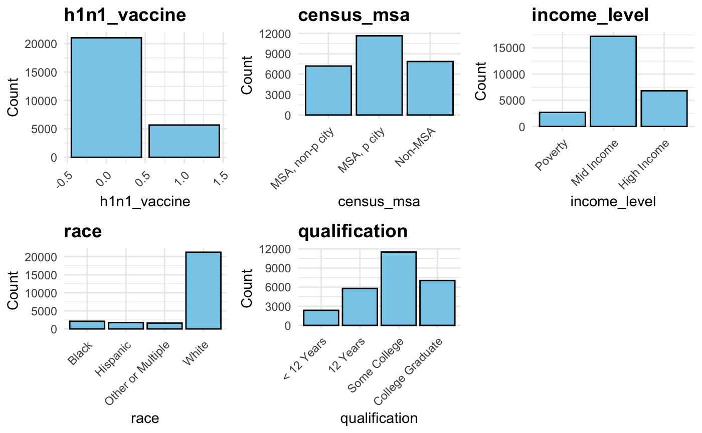
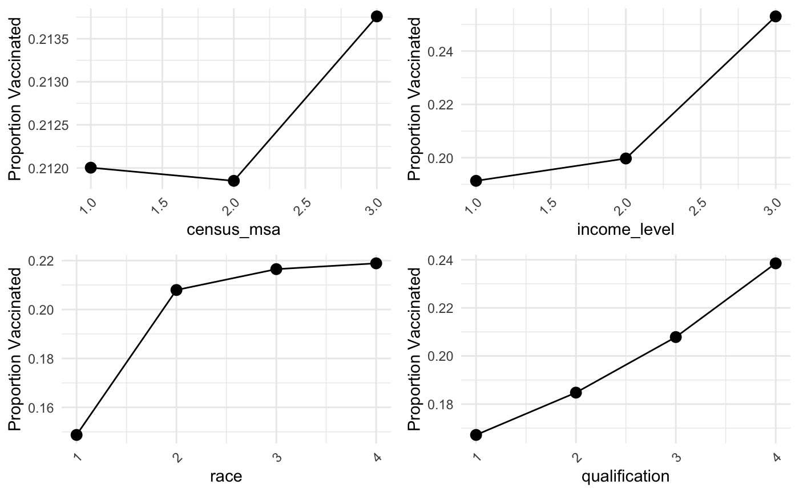
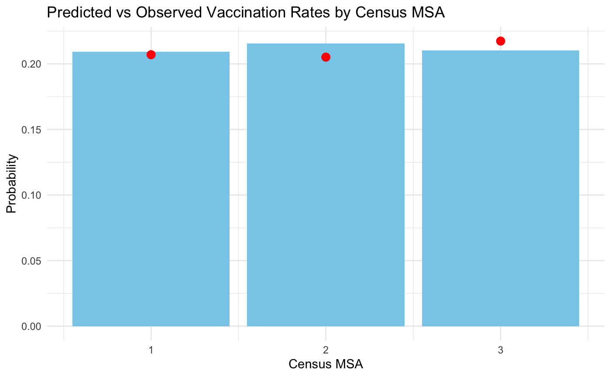

\section{Introduction}

The H1N1 influenza pandemic of 2009-2010 brought global attention to the importance of vaccinations in controlling the spread of infectious diseases. Despite the availability of an effective vaccine, many individuals remained unvaccinated. So there is a need to better understand the factors influencing vaccination behavior. This project aims to predict H1N1 vaccination rates using a dataset from the 2009 National H1N1 Flu Survey, which includes information on over 26,000 individuals across 36 features. These features span demographic factors (such as education, age, and gender), behavioral patterns (such as worry about H1N1 and efforts to avoid large gatherings), and health indicators (such as chronic medical conditions and insurance status).

By applying Bayesian hierarchical modeling, we aim to uncover how these variables interact to influence vaccination decisions. This approach allows us to account for group-level differences, such as variations by geographic region or educational background, while also capturing individual-level behaviors. The insights gained from this study can inform public health policies by identifying key factors to vaccination and tailoring strategies to specific population segments. 

\section{Data Preprocessing and Exploratory Data Analysis (EDA)}

In this section, we focused on preparing the dataset and exploring key patterns to understand H1N1 vaccination behavior. Missing values in numeric variables were imputed with their medians, and categorical variables were filled with their mode. Categorical variables were then encoded into numeric formats, with ordinal features like income level and education, to reflect their natural order; non-ordinal variables are treated as independent categories. The dataset was then split into training and testing data sets (70% and 30%, respectively).

```{r, echo=FALSE, out.width="70%",fig.align='center'}

```

In exploratory data analysis (EDA), we focused on the distribution of key variables through bar plots. For the reponse variable, `h1n1_vaccine`, the plot showed that approximately 75% of individuals were not vaccinated. The variable `census_msa` for location, showed that roughly 40% of the individuals lived in metropolitan principal cities, while smaller proportions lived in non-principal city areas and non-metropolitan regions. Similarly, for income_level, more than 50% of the individuals are in the mid-income category, with fewer individuals in the high-income or below-poverty categories. Educational level (`qualification`) plot indicated that approximately 40% of the sample were college graduates, while the remaining participants were distributed across lower education levels. These plots give us a clear picture of the dataset’s composition.

Proportional analysis using line plots provided further evidence of these patterns. Vaccination rates were highest in metropolitan areas. It also shows a clear trend in different income and education levels, where higher socioeconomic status correlated with increased probability of vaccination. Racial differences were also observed, with white individuals having the highest vaccination rates compared to other races. These findings show  differences in vaccine adoption across demographic, geographic, and socioeconomic factors, which can help us determine the Bayesian model we are going to use.

```{r, echo=FALSE, out.width="70%",fig.align='center'}

```

\section{Why Hierarchical Bayesian Model Work}

The insights from exploratory data analysis (EDA) indicated a strong the linear trends of vaccination rate across groups like qualification and income level. These trends suggest a systematic relationship between socioeconomic factors and likelihood of getting vaccine. This notion is further supported by a study by Liu et al. (2019), which found that lower socioeconomic status (SES), such as lower education level, is associated with lower vaccination rates. All those evidence indicates that we can use a hierarchical structure to model these stratified relationships. To predict the probability of receiving the H1N1 vaccination, we use logistic regression within a hierarchical Bayesian framework, where the log-odds of vaccination are modeled as a linear combination of predictors. The intercept in the model follows a group-specific distribution, which vary across levels such as the education level (`qualification`) or the household location (`census_msa`). This structure captures differences across demographic groups, such as qualification levels or regional census areas, while incorporating individual-level predictors like age or income, which is an ideal model for goal of this project.

To analyze  and comparedthe impact of group-level factors, we used two hierarchical Bayesian models. The first model includes `qualification` as the group-level intercept, while the second model uses `census_msa` as the intercept to account for regional variations. Both models include individual-level predictors such as age, income, and employment status. The hierarchical structure balances group-level effects through partial pooling. We aim to compare how educational and regional factors influence vaccination behavior and assess which model offers better predictive accuracy.

\section{Feature Selection}

Feature selection was a critical step in refining the predictors for both hierarchical Bayesian models. It could help to improve the computational efficiency and interpretability. We employed Lasso regularization, a technique that penalizes the absolute size of regression coefficients, shrinking less relevant predictors to zero. This allowed us to identify a meaningful subset of predictors, such as `h1n1_awareness`, `dr_recc_h1n1_vacc`, and `age_bracket`, and exclude less relevant variables like `avoid_touch_face` and `no_of_adults`.

The Lasso regularization process was applied to both models. For each model, the strength of the penalty was determined by the regularization parameter \( \lambda \), which controls the extent of coefficient shrinkage. Using 5-fold cross-validation, we selected \( \lambda_{\text{min}} \), the value of \( \lambda \) that maximized the Area Under the Curve (AUC) metric. The selected features were then incorporated into the hierarchical Bayesian models: in the first model, `qualification` was used as the group-level intercept, while in the second model, `census_msa` served as the group-level effect. By applying Lasso feature selection across both models, we ensured that we only keep the most relevant predictors.

\begin{table}[ht]
\centering
\caption{Removed Features for Each Model}
\label{tab:removed-features}
\begin{tabular}{|l|p{10cm}|}
\hline
\textbf{Model} & \textbf{Removed Features} \\ \hline
Model 1: Qualification & wash\_hands\_frequently, avoid\_touch\_face, census\_msa, no\_of\_adults \\ \hline
Model 2: Census\_msa & wash\_hands\_frequently, reduced\_outside\_home\_cont, avoid\_touch\_face, income\_level, no\_of\_adults \\ \hline
\end{tabular}
\end{table}

\section{RStan Hierarchical Bayesian Model Explanation}

The hierarchical Bayesian model is designed to capture both individual- and group-level variations in H1N1 vaccination behavior. In the first model, **qualification** serves as the group-level effect, with each qualification level having its own intercept to account for differences in baseline vaccination probabilities. This structure allows us to model heterogeneity across groups while borrowing information across all levels to improve stability.

The response variable \( y \) is binary, representing whether an individual received the H1N1 vaccine (\( y_i = 1 \)) or not (\( y_i = 0 \)). The likelihood of \( y \) is modeled using a logistic regression framework with the following equation:

\[
y_i \sim \text{Bernoulli}(\theta_i), \quad \text{where } \theta_i = \text{logit}^{-1}(\alpha_{\text{qualification}[i]} + \mathbf{x}_i^T \boldsymbol{\beta}).
\]

Here, \( \theta_i \) represents the predicted probability of vaccination for individual \( i \), \( \alpha_{\text{qualification}[i]} \) is the intercept specific to the qualification level of individual \( i \), \( \mathbf{x}_i \) is the vector of selected predictors for individual \( i \), and \( \boldsymbol{\beta} \) is the vector of coefficients for these predictors.

Each qualification level has its own intercept \( \alpha_j \), which is modeled as:
\[
\alpha_j \sim \mathcal{N}(\mu_\alpha, \sigma_\alpha),
\]
where \( \mu_\alpha \) is the global mean of the group-level intercepts and \( \sigma_\alpha \) represents their variability. The hierarchical prior reflects our belief that qualification groups are similar but not identical in their baseline vaccination probabilities. By introducing this structure, we borrow strength across qualification levels. 

The prior on \( \mu_\alpha \), modeled as: \[\mu_\alpha \sim \mathcal{N}(0, 1),\] is weakly informative, centering the global mean around zero with moderate uncertainty. This hyper prior was selected because we believe that the average baseline probability of vaccination across all qualification levels is centered around zero (on the logit scale), with moderate variability. A standard deviation of 1 was chosen to allow sufficient flexibility for the model to capture meaningful shifts in the global intercept while avoiding overly broad values. For \( \sigma_\alpha \), we have\[\sigma_\alpha \sim \text{Cauchy}(0, 1.5),\]The heavier tails of the Cauchy distribution allow the model to account for significant differences between qualification groups, such as large variations in baseline vaccination rates.The scale parameter of 1.5 also prevent destabilizing the model or overly constraining the group-level effects.


The coefficients of the individual-level predictors \( \beta_k \) are modeled as:
\[
\beta_k \sim \mathcal{N}(0, 1).
\]
This normal prior assumes that most predictors have moderate effects centered around zero, with a standard deviation of 1. It reflects established evidence that certain predictors, like doctor's recommendation for H1N1 vaccination (dr_recc_h1n1_vacc) and whether the individual is a health worker (is_health_worker), have strong positive effects on vaccination behavior. For example, previous studies have shown that healthcare workers is a priority group for vaccination with over 97.5% vaccination rate for nurses [Pandey et al., 2013]; While most of others, such as whether an individual practices the habit of avoiding touching their face (avoid_touch_face) and the number of adults living in a household (no_of_adults), are likely to have minimal impact. In our dataset, since the majority of predictors are not expected to have as strong of an effect on vaccination behavior as variables like 'is_health_worker', we center the prior at zero to assume moderate effects, and a standard deviation of 1 allows enough variability for significant predictors to show their influence. This prior is grounded in observed trends and helps balance the model’s simplicity.

The likelihood of the observed data is modeled using a Bernoulli distribution:
\[
y_i \sim \text{Bernoulli}(\theta_i), \quad \text{where } \theta_i = \text{logit}^{-1}(\alpha_{\text{qualification}[i]} + \mathbf{x}_i^T \boldsymbol{\beta}).
\]
This likelihood reflects the binary nature of the outcome variable and is a natural choice for modeling vaccination behavior.

Finally, the generated quantities also include the log-likelihood for each observation:
\[
\text{log\_lik}_i = \text{Bernoulli\_lpmf}(y_i | \theta_i).
\]
These quantities are critical for interpreting individual predictions and evaluating model performance using techniques like Leave-One-Out Cross-Validation (LOO).

\section{RStan Hierarchical Bayesian Model Explanation for Census MSA}

This hierarchical Bayesian model is similar to the previous model of \texttt{qualification}, as it is also designed to capture both individual- and group-level variations in H1N1 vaccination behavior. In this model, \texttt{census\_msa} represents the group-level effect, with each level of \texttt{census\_msa} having its own intercept to account for differences in baseline vaccination probabilities. This structure allows us to model heterogeneity across geographic regions while borrowing information across all levels to improve stability. \par

The response variable $y$ is binary, representing whether an individual received the H1N1 vaccine ($y_i = 1$) or not ($y_i = 0$). The likelihood of $y$ is modeled using a logistic regression framework:

\[
y_i \sim \text{Bernoulli}(\theta_i), \quad \theta_i = \text{logit}^{-1}(\alpha_{\text{census}[i]} + \mathbf{x}_i^\top \boldsymbol{\beta}),
\]

where the only difference from the previous model is $\alpha_{\text{census}[i]}$ is the intercept specific to the \texttt{census\_msa} group of individual $i$ in this case. \par

Each \texttt{census\_msa} level also has its own intercept:
\[
\alpha_j \sim \mathcal{N}(\mu_\alpha, \sigma_\alpha),
\]
where $\mu_\alpha$ is the global mean of the group-level intercepts, and $\sigma_\alpha$ is the standard deviation representing variability in baseline vaccination probabilities across different regions. \par


We use hyperpriors that is similar to the previous one, as hyperpriors add another layer to the model. Here, $\mu_\alpha \sim \mathcal{N}(0, 1)$ is the weakly informative prior, which centers the global mean around 0. The standard deviation of 1 allows flexibility to capture meaningful shifts while avoiding extreme values. $\sigma_\alpha \sim \text{Cauchy}(0, 1.5)$ is the heavier tails of the Cauchy distribution account for potential large differences between regions while ensuring numerical stability. Similar to the previous model, the scale of 1.5 reflects our belief that regional differences exist but are not expected to be extreme. \par


The coefficients of the individual-level predictors $\beta_k$ are modeled as:
\[
\beta_k \sim \mathcal{N}(0, 1).
\]

Similar to reasonings in the previous model, a normal prior centering around zero and having the standard deviation of 1 reflect prior knowledge that some predictors may have significant impacts (e.g., \texttt{dr\_recc\_h1n1\_vacc}, which is H1N1 flu vaccine was recommended by doctor), while most of others not. \par


The likelihood reflects the binary nature of the outcome variable:
\[
y_i \sim \text{Bernoulli}(\theta_i), \quad \theta_i = \text{logit}^{-1}(\alpha_{\text{census}[i]} + \mathbf{x}_i^\top \boldsymbol{\beta}).
\]


For our generated quantities, predicted probabilities ($\theta$) compute $\theta_i = \text{logit}^{-1}(\alpha_{\text{census}[i]} + \mathbf{x}_i^\top \boldsymbol{\beta})$ for each individual, and log-likelihood ($\text{log\_lik}_i$) are values used for model evaluation via Leave-One-Out Cross-Validation (LOO). \par


Overall, this model leverages the hierarchical Bayesian framework to capture variability in vaccination behavior across different regions, while also focusing on individual-level predictors. By incorporating both group-level and individual-level effects, the model provides robust insights into geographic disparities in vaccination rates.

\section{Using the LOO Package for Model Comparison}
To compare the predictive performance of the hierarchical Bayesian models, we conducted Leave-One-Out Cross-Validation (LOO-CV) using the \texttt{loo} package. Two models were compared: one with \texttt{qualification} as the group-level effect and the other with \texttt{census\_msa}. The LOO-CV method computes the Expected Log Predictive Density (ELPD) for each model, measuring how well the model predicts unseen data by leaving out individual observations from the evaluation process.

Log-likelihood values for both models were obtained from their posterior distributions, and the \texttt{loo} function was applied to compute the ELPD scores. The \texttt{loo\_compare} function ranked the models based on ELPD differences. The model using \texttt{census\_msa} had a slightly higher ELPD score of 0 and standard error of 0, compared with the model using \texttt{qualification} that had an ELPD score of -1.9 and standard error of 1.4, indicating better predictive accuracy. However, since 0 is included in the 95% confidence interval, we fail to reject that there is a significant difference between these two models. At this time, we will continue to analyze our results of the model of \texttt{census\_msa}.

\begin{table}[ht]
\centering
\caption{LOO Model Comparison Results}
\label{tab:loo-comparison}
\begin{tabular}{lcc}
\hline
\textbf{Model} & \textbf{ELPD Difference} & \textbf{SE (Difference)} \\
\hline
census\_msa (Model 2) & 0.0 & 0.0 \\
qualification (Model 1) & -1.9 & 1.4 \\
\hline
\end{tabular}
\end{table}

\section{Grouped Prediction Analysis}
The grouped prediction analysis evaluates the model's ability to predict vaccination rates across \texttt{census\_msa} groups. Using the test dataset, predicted probabilities for each individual were aggregated at the group level to compute the mean predicted probability for each \texttt{census\_msa}. These mean probabilities were then compared with the observed vaccination rates within each group.

As shown in the following table, for Group 1, the mean predicted probability is 0.209, which is very close to the observed rate of 0.207, showing excellent model accuracy for this group. In Group 2, the predicted mean is 0.216, which is slightly higher than the observed rate of 0.205, suggesting a minor overestimation. Similarly, for Group 3, the predicted mean of 0.210 is a little lower than the observed rate of 0.217, which is a small underestimation. Overall, the close results between predicted and observed values across all groups demonstrate the model’s ability in providing accurate group-level predictions. Thus, the inclusion of census_msa as a group-level effect in this hierarchical structure is effective.


\begin{table}[ht]
\centering
\caption{Mean Predicted vs Observed by Census MSA}
\label{tab:mean-predicted-observed}
\begin{tabular}{lcc}
\hline
\textbf{census\_msa} & \textbf{mean\_predicted} & \textbf{mean\_observed} \\
\hline
1                   & 0.209                   & 0.207                   \\
2                   & 0.216                   & 0.205                   \\
3                   & 0.210                   & 0.217                   \\
\hline
\end{tabular}
\end{table}


A bar plot was also created to display the mean predicted probabilities for each group, with observed rates overlaid as points to highlight the alignment between predictions and actual outcomes. 

```{r, echo=FALSE, out.width="70%",fig.align='center'}

```

\section{Reference}

1. Pandey, S., Bian, J., and Lipscomb, J. "Healthcare Workers and Vaccination Against Pandemic and Seasonal Influenza: A Review of Evidence." Vaccine, vol. 31, no. 10, 2013, pp. 1165–1171, https://pmc.ncbi.nlm.nih.gov/articles/PMC8011776/
2. Bian, J., Lipscomb, J., and Pandey, S. "Socioeconomic Disparities in Seasonal Influenza Vaccination Among Adults." American Journal of Preventive Medicine, vol. 44, no. 2, 2013, pp. 122–130, https://pmc.ncbi.nlm.nih.gov/articles/PMC3657864/
3. Sivabalan, A. "H1N1 Flu Vaccine Dataset." Kaggle, 2019, https://www.kaggle.com/datasets/sivabalana/h1n1-flu-vaccine/data.

\section{Team Contribution}

Yiou Wang: 1. Contributing to half of the project proposal by writing the potential statistical models, prior and posteriors specification, and so on.  2. Performed data preprocessing and cleaning; Designed and implemented hierarchical Bayesian model where qualification is used as group-level intercept; and used LOO package for validation in R. 4. Created corresponding slides of the presentation. 5. Wrote "Why Hierarchical Bayesian Model Work", "Feature Selection", and "RStan Hierarchical Bayesian Model Explanation" sections in this paper. 


